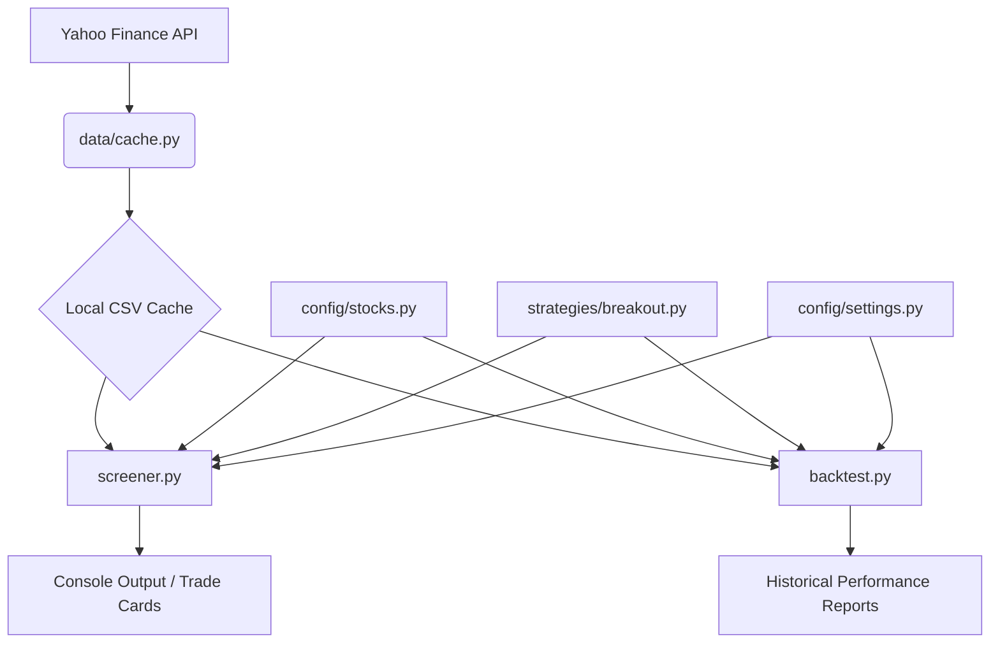

# 🏛 System Architecture — Swing Trading System

This document outlines the technical architecture of the NSE India Swing Trading System.

---

## 🧩 Component Overview

The system is built as a set of modular Python scripts and configuration files, designed to be run from the command line.

### 1. **Screener (`screener.py`)**
-   **Purpose**: Scans the NSE stock universe for live breakout setups.
-   **Input**: Stock universe from `config/stocks.py`, settings from `config/settings.py`.
-   **Output**: Ranked trade cards with breakout entry levels, stop losses, and targets.
-   **Stages**:
    -   **Market Regime**: Nifty 50 status check.
    -   **Liquidity Filter**: Minimum daily turnover.
    -   **Trend Filter**: EMA crossovers.
    -   **Consolidation (Coil) Filter**: Tight price range near highs.
    -   **Risk Filter**: Stop loss within acceptable percentage.
    -   **Volume Filter**: Volume surge versus 20-day average.

### 2. **Backtester (`backtest.py`)**
-   **Purpose**: Simulates historical trading using the same strategy logic as the screener.
-   **Features**: Supporting concurrent positions, risk-based position sizing, and sector caps.
-   **Metrics**: Win rate, profit/loss (PnL), realized risk/reward (RR), and walk-forward validation.

### 3. **Strategy Engine (`strategies/breakout.py`)**
-   **Purpose**: Single source of truth for strategy logic.
-   **Logic**: Contains the math for EMA crossovers, consolidation detection, volume surges, and scoring algorithms.

### 4. **Data Layer (`data/`)**
-   **`cache.py`**: Handles OHLCV data fetching (via Yahoo Finance) and local CSV caching.
-   **`earnings.py`**: Fetches earnings dates to avoid trading through high-volatility events.

---

## 🔄 Data Flow

---

## 🛠 Core Technologies
-   **Language**: Python 3.10+
-   **Libraries**:
    -   `pandas` (Data processing)
    -   `yfinance` (Data acquisition)
    -   `argparse` (Command-line interface)

---

## ⚙️ Configuration
The system is highly configurable through two main files:
-   **`config/settings.py`**: System-wide parameters (risk metrics, EMA lengths, periods).
-   **`config/stocks.py`**: Managed list of NSE tickers and their sectors.
